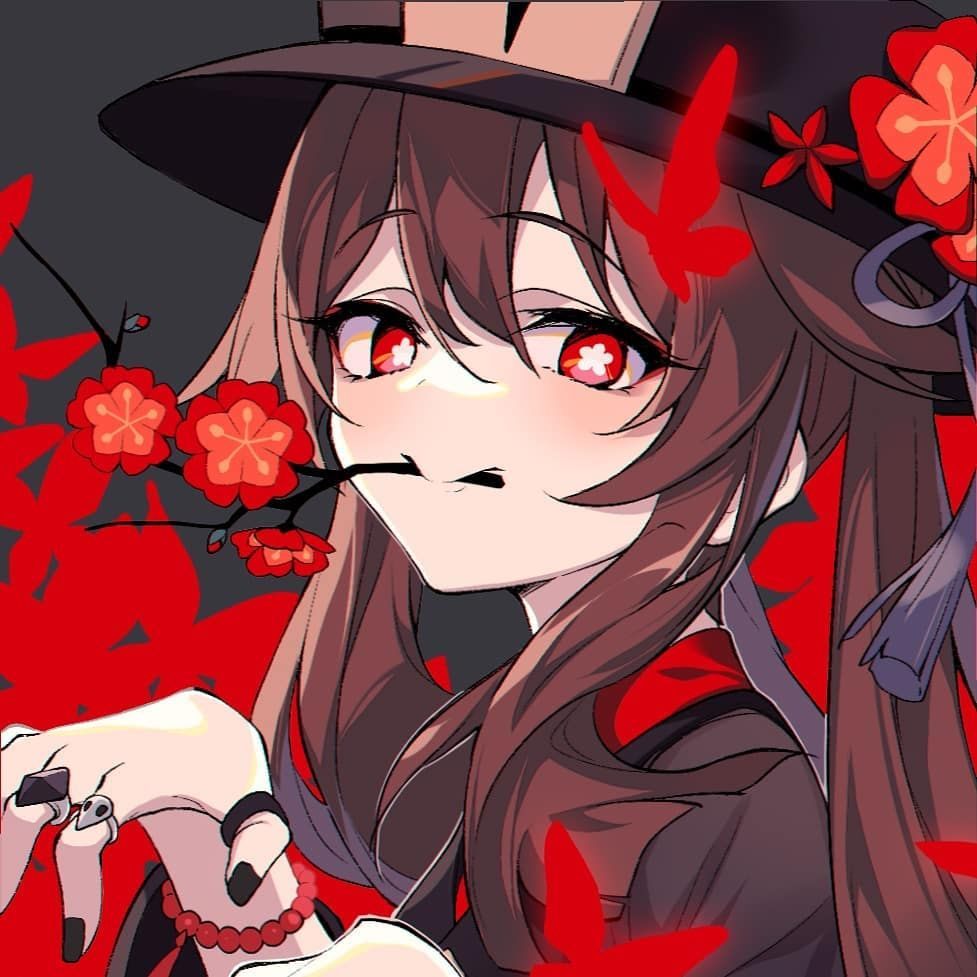

  

<!-- Social icons section -->

## 👋 Hi there, I'm Newbie here, help me to become a better person!

#### **Here are facts about me to get you started**
- 🔭 A newbie programmer
- 💬 Feel free to me.
- 😍 have an interest in *Java, Kotlin* 
- 🤝 Let's connect! Find me on
  -  `gmail`: alwaysmori16@gmail.com
  -  `Discord` : alwaysmori

  
<h5> 😅 Details about me</h5>

  

  

  <h3>🔥 Streak Stats</h3>

  <!-- GitHub Readme Streak Stats - https://github.com/DenverCoder1/github-readme-streak-stats -->
  

    
    
🔥 Get streak stats for your profile at <a href="AlwaysMori.github.io">AlwaysMori.github.io</a>

  

  <h3>💻💬 GitHub Profile Stats</h3>

  

    
    
    
    
    
    
    
    
    
    
    
    
    
    
    
    
    
    
    
    
    
    
    
    

  
  
  

  <b>Note:</b> Top languages is only a metric of the languages my public code consists of and doesn't reflect experience or skill level.

  

  <h3>⚡ Recent GitHub Activity</h3>

 
  

  

  

##

    
    
    
    
    
    
    
    
    
    
    
    
    
       

 

